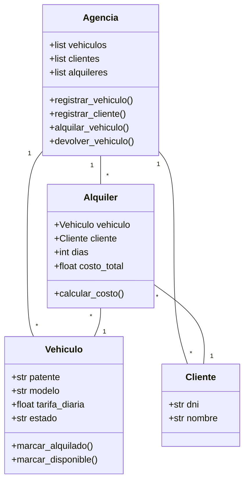
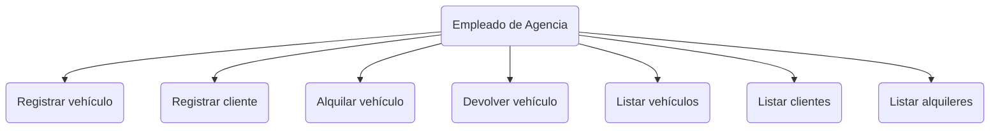
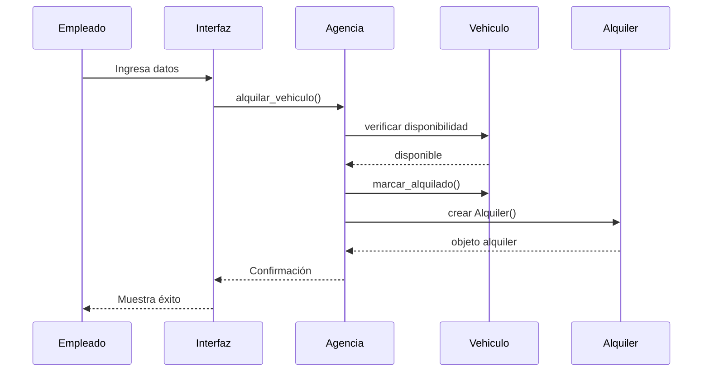

# AutoRent — Sistema de Alquiler de Vehículos

## Objetivo del Software
[cite_start]AutoRent es una aplicación de escritorio diseñada para gestionar de manera eficiente el alquiler de vehículos, permitiendo el control de la flota, el registro de clientes y la automatización de los cálculos de costos de alquiler[cite: 177].

## Requerimientos Funcionales
| ID | Requerimiento | Tipo |
|:---:|---|:---:|
| RF01 | Registrar vehículos con patente, modelo y tarifa diaria | Funcional |
| RF02 | Registrar clientes con DNI y nombre | Funcional |
| RF03 | Alquilar vehículo disponible a un cliente por N días | Funcional |
| RF04 | Procesar devolución y calcular costo total | Funcional |
| RF05 | Listar vehículos (todos / disponibles / alquilados) | Funcional |
| RF06 | Listar clientes registrados | Funcional |
| RF07 | Listar alquileres activos | Funcional |
[cite_start][cite: 184]

## Requerimientos No Funcionales
| ID | Requerimiento | Tipo |
|:---:|---|:---:|
| RNF01 | Interfaz gráfica de escritorio (CustomTkinter) | No Funcional |
| RNF02 | Validación de datos en todos los formularios | No Funcional |
| RNF03 | Feedback visual inmediato ante errores o éxitos | No Funcional |
| RNF04 | El sistema debe ejecutarse en Python 3.10+ | No Funcional |
| RNF05 | Navegación por secciones sin recargar la aplicación | No Funcional |
[cite_start][cite: 184, 185]

## Tecnologías utilizadas
* Python 3.10+
* [cite_start]CustomTkinter para la interfaz gráfica[cite: 184, 185].

## Diagramas UML
### Diagrama de Clases


### Diagrama de Casos de Uso


### Diagrama de Secuencia


## 📋 Índice de Documentación de Testing

A continuación, se presentan los accesos directos a todos los artefactos y planes de prueba diseñados y ejecutados para el sistema AutoRent:

| Documento | Descripción |
| :--- | :--- |
| [docs/uml_clases.md](docs/uml_clases.md) | UML clases del sistema |
| [docs/uml_casos_uso.md](docs/uml_casos_uso.md) | UML casos de uso |
| [docs/uml_secuencia.md](docs/uml_secuencia.md) | Diagrama de secuencia |
| [docs/pruebas/01_prueba_componentes.md](docs/pruebas/01_prueba_componentes.md) | Casos unitarios por clase |
| [docs/pruebas/02_prueba_integracion.md](docs/pruebas/02_prueba_integracion.md) | Flujos entre clases |
| [docs/pruebas/03_prueba_caja_negra.md](docs/pruebas/03_prueba_caja_negra.md) | Particiones y valores límite |
| [docs/pruebas/04_prueba_rendimiento.md](docs/pruebas/04_prueba_rendimiento.md) | Carga y tiempo de respuesta |
| [docs/pruebas/05_prueba_interfaz.md](docs/pruebas/05_prueba_interfaz.md) | Comportamiento visual |
| [docs/pruebas/06_prueba_camino.md](docs/pruebas/06_prueba_camino.md) | Caja blanca / ciclo |
| [docs/ejecucion/plan_ejecucion.md](docs/ejecucion/plan_ejecucion.md) | Cronograma y ambiente |
| [docs/ejecucion/resultados_ejecucion.md](docs/ejecucion/resultados_ejecucion.md) | Resultados reales de ejecución |
| [docs/e2e/pruebas_e2e.md](docs/e2e/pruebas_e2e.md) | Flujos completos de usuario |

---
🔬 **Estado del Proyecto:** Entrega Final Completada.

---

## 🧪 Demostración de Modificación en Vivo (Introducción de Bug)

Como parte de la defensa presencial del Trabajo Práctico, se realizó una modificación intencional en vivo en el código fuente para demostrar cómo un error lógico impacta en el sistema y cómo nuestra suite de pruebas lo detectaría de inmediato.

### 🛠️ Línea Modificada (Clase `Alquiler`)
* **Código Original (Correcto):**
  ```python
  def calcular_costo(self):
      return self.dias * self.vehiculo.tarifa_diaria
